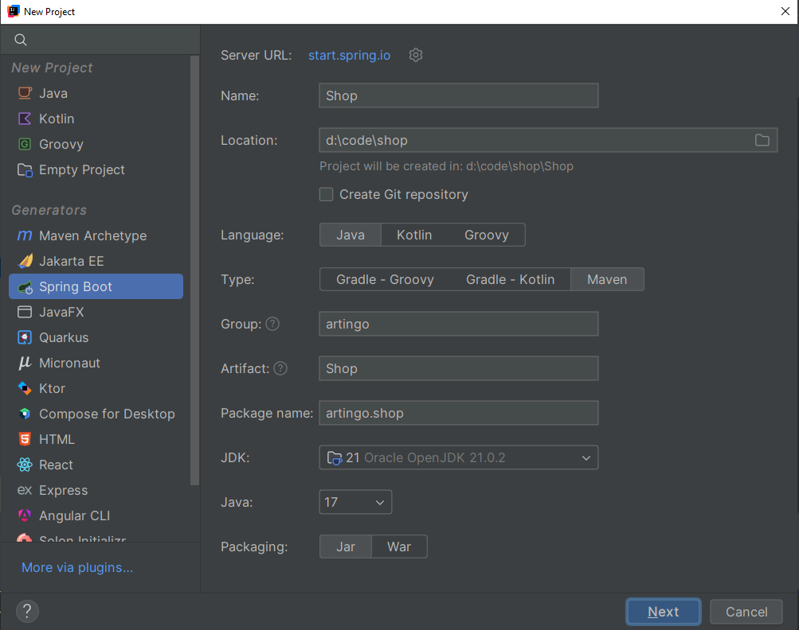
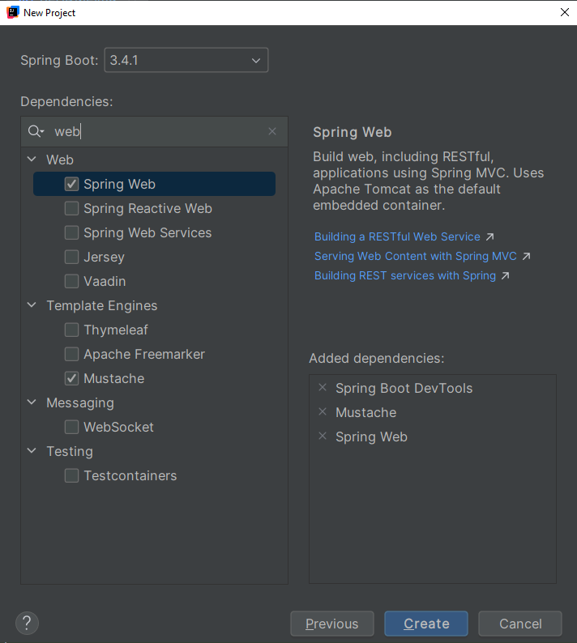
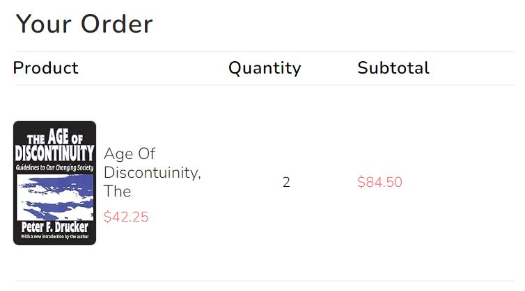
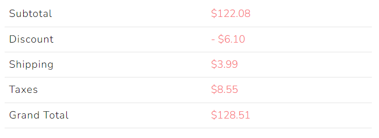

# Spring Boot course

This project is meant to teach Spring B oot fundamentals by creating a bookshop, step by step. <br/>
It uses the [Spring Boot](https://docs.spring.io/spring-boot/docs/current/reference/html/getting-started.html) framework, a [Bootstrap 5](https://getbootstrap.com) frontend and stores its data in [CSV](https://en.wikipedia.org/wiki/Comma-separated_values) files.

This is how the final shop looks like:

<br/>
<br/>

Follow these steps to implement the bookshop:
## 1. Create project
1. In your IDE, create a new Spring Boot project:<br/>
   
1. On the next screen, select the following dependencies:
   * DevTools (for instant refresh)
   * Mustache (as templating engine for interactive HTML pages)
   * Spring Web (to add the Tomcat webserver)<br/>

   
1. Wait until all files and folders are created.
   
1. In your [application.properties](src/main/resources/application.properties), set the Mustache file suffix to `html`:
   ```properties
   spring.application.name=Book Shop
   spring.mustache.suffix=.html
   ```

## 2. Find a HTML template
1. Go to a template portal, e.g. [TemplatesJungle](https://templatesjungle.com/ecommerce/), and select a proper HTML template for your shop.
1. Klick the [download](https://templatesjungle.gumroad.com/l/electrostore-bootstrap-html-template) button and continue to checkout.
1. Open the ZIP file in your "Downloads" folder and extract it to your [resources/static](src/main/resources/static) directory, including subdirectories.

## 3. Add static resources  
1. Your [static](src/main/resources/static) folder structure should look similar to this, now:<br/>
     
  
1. In the [Shop](src/main/java/onlineshop/Shop.java) class, start the Spring Boot server.
   ```java
   @SpringBootApplication
   public class Shop {
      public static void main(String[] args) {
        SpringApplication.run(Shop.class, args);
      }
   }
   ```
1. Open this URL in your Browser: http://localhost:8080 <br/>
   Your static [start page](http://localhost:8080/index.html) should appear.

## 3. Create a Controller
1. Create a Controller class named [ShopController.java](src/main/java/onlineshop/controllers/ShopController.java)
2. Give it a `@Controller` annotation.
3. Add a method to handle the root URL: "/"
4. Add a method to handle `.html` URLs. The result should look like this:
   ```java
   @Controller
   public class ShopController {
        @GetMapping(value = {"/"})
        public String root(Model model) {
            return "redirect:/index.html";
        }
   
        @GetMapping(value = {"/{name}.html"})
        public String htmlMapping(@PathVariable String name, HttpSession session) {
            return name;
        }
   }
   ```
## 4. Make static HTML pages dynamic
1. Under the [resources](src/main/resources) directory, create a [templates](src/main/resources/templates) folder.
1. Move all HTML files from [static](src/main/resources/static) to [templates](src/main/resources/templates) folder.
1. Restart the web server ([http://localhost:8080](http://localhost:8080)) and test whether the HTML page links still work properly.
1. Under [templates](src/main/resources/templates), create a [partials](src/main/resources/templates/partials) folder.
1. From the [index.html](src/main/resources/templates/index.html) file, cut out part of the HTML head section and paste it into a new [partials/htmlHead.html](src/main/resources/templates/partials/htmlHead.html) file:
   ```html
   <meta charset="utf-8">
   <meta http-equiv="X-UA-Compatible" content="IE=edge">
   <meta name="viewport" content="width=device-width, initial-scale=1.0">
   <link rel="icon" href="/images/favicon.ico" sizes="48x48">
   <link rel="stylesheet" type="text/css" href="/css/bootstrap.min.css">
   <link rel="stylesheet" type="text/css" href="/css/style.css">
   <link rel="stylesheet" type="text/css" href="/css/swiper-bundle.min.css"/>
   <link rel="preconnect" href="https://fonts.googleapis.com">
   <link rel="preconnect" href="https://fonts.gstatic.com" crossorigin>
   ```
1. In the [index](src/main/resources/templates/index.html) file, create a reference to the freshly created [htmlHead](src/main/resources/templates/partials/htmlHead.html) file.
   ```handlebars
   <!DOCTYPE html>
   <html lang="end">
   <head>
       <title>Overview</title>
       {{> partials/htmlHead }}
   </head>
   ```
1. Repeat these steps for [header](src/main/resources/templates/partials/header.html), [footer](src/main/resources/templates/partials/footer.html) and other page sections.

1. Your file structure should look similar to this, now:<br/>
   
1. Your HTML file should look like this:
   ```handlebars
   <!DOCTYPE html>
   <html lang="en">
   <head>
       <title>Overview</title>
       {{> partials/htmlHead }}
   </head>
   <body>
   {{> partials/header }}
   <section class="hero-section position-relative padding-small">
       ...
   </section>
   <div class="shopify-grid padding-small">
       ...
   </div>
   {{> partials/footer }}
   </body>
   </html>
   ```
1. Repeat these steps for all other HTML files: replace their partials code by Mustache templates.

## 5. Create model classes
1. In the [merchandise](src/main/java/onlineshop/merchandise) folder, create an [Article.java](src/main/java/onlineshop/merchandise/Article.java) class.
1. It should contain the basic article fields:
   ```java
   public class Article {
     /** Unique article number */
     protected int articleNo;
     /** Display-title of this Article */
     protected String title;
     /** Manufacturer of this Article */
     protected String manufacturer;
     /** Shop price */
     protected double price;
     /** URL to the image */
     protected String image;
     ...
   }
   ```
1. Also, create a [Book](src/main/java/onlineshop/merchandise/Book.java) class containing following fields:
   ```java
   public class Book extends Article {
     protected int pages;
     protected String author;
     protected Format format;
     protected Genre genre;
     ...
   }
   ```
## 6. Import and display articles
1. In the [resources](src/main/resources) directory, create a [CSV file](src/main/resources/books.csv) containing a list of articles or books. It could look like this:
   ```
   Title;Author;Genre;Pages;Publisher;Price;Image
   God Created the Integers;Hawking, Stephen;mathematics;197;Penguin;24,50;https://m.media-amazon.com/images/I/71HKbmRoVmL._AC_UY218_.jpg
   ```
1. To facilitate the import of CSV files, add “commons-csv” to the dependencies in the [pom.xml](pom.xml):
   ```xml
   <dependency>
      <groupId>org.apache.commons</groupId>
      <artifactId>commons-csv</artifactId>
      <version>1.10.0</version>
   </dependency>
   ```
1. In the  [Shop](src/main/java/onlineshop/Shop.java) class, create a `readArticles()` method that will read a CSV file and fill a [Book](src/main/java/onlineshop/merchandise/Book.java) list from it. Pass the `fileName` and `List` as parameters:
   ```java
   private static void readArticles(String fileName, List<Book> books) { ... }
   ```
   
1. Create a getter method so that we can access the article list from outside.
   ```java
   public static List<Book> getArticles() {
        return books;
   }
   ```
1. In [ShopController.homePage()](src/main/java/onlineshop/controllers/ShopController.java#L28), load the article list and pass it to the view model.
   ```java
   @GetMapping(value = {"/index.html"})
   public String homePage(Model model) {
        model.addAttribute("articles", Shop.getArticles());
        return "index";
   }
   ```
1. In the [index.html](src/main/resources/templates/index.html) template, iterate over the `articles`. Integrate the article fields in the proper HTML code section.
   ```handlebars
   <div class="row product-content product-store">
     {{#articles}}
         <div class="col-lg-3 col-md-4 mb-4">
             <div class="card position-relative p-4 border rounded-3">
                 
                 <h6 class="mt-4 mb-0 fw-bold"><a href="#">{{title}}</a></h6>
                 <div class="review-content d-flex">
                     <p class="my-2 me-2 fs-6 text-black-50">{{author}}</p>
                 </div>
                 <span class="price mb-2 text-primary">{{price}}$</span>
                 <div class="card-concern position-absolute start-0 end-0 d-flex gap-2">
                     <button type="button" href="#" class="btn btn-dark" data-bs-toggle="tooltip" 
                       data-bs-placement="top" data-bs-title="Tooltip on top">
                         <svg class="cart"><use xlink:href="#cart"></use></svg>
                     </button>
                 </div>
             </div>
         </div>
     {{/articles}}
   </div>
   ```
1. Check the result in your browser. The dynamic articles from the CSV file should appear on your homepage: http://localhost:8080. The result should look like this:<br/>
   

## 7. Implement the cart functionality
### Add a CartItem class
1. To be able to add multiple copies of an item to the shopping cart, we need to extend the article or book class. To do this, we create a new [CartItem](src/main/java/onlineshop/merchandise/CartItem.java) class in the [merchandise](src/main/java/onlineshop/merchandise) package, which inherits from Book. 
2. Add a `quantity` field and generate a getter and setter for it.
3. Create a `getTotalPrice()` method which calculates the total price, taking into account the quantity. The code should look like this:
   ```java
   public class CartItem extends Book {
    private int quantity = 0;

    public int getQuantity() { return quantity; }
    public void setQuantity(int quantity) { this.quantity = quantity; }

    public double getTotalPrice() { return quantity * price; }
   }
   ```
### Refactor the Cart class
1. As we have changed the cart items from [Article](src/main/java/onlineshop/merchandise/Article.java) to [CartItem](src/main/java/onlineshop/merchandise/CartItem.java), we must refactor and correct all corresponding code lines. 
2. We want to use the shopping cart in the web server session, so we have to use the proper Spring Annotations. The resulting code should look like this:
   ```java
   @Component
   @SessionScope
   public class Cart {
        private List<CartItem> items = new ArrayList<>();
   
        public List<CartItem> getItems() { return items; }
   }
   ```
3. Create a method that finds a cart item by its article number:
   ```java
   private CartItem findItem(int articleNo) { ... }
   ```
4. Create a method to add an article to the shopping cart. If the article already exists, its quantity should be increased.
   ```java
   public void addArticle(Book book) { ... }
   ```
5. Create a method to remove an article from the shopping cart.
   ```java
   public boolean removeArticle(int articleNo) { ... }
   ```
6. Create a method to decrease the quantity of an existing article.
   ```java
   public boolean decreaseQuantity(int articleNo) { ... }
   ```

### Modify the ShopController
1. To use the Shop sortiment and Cart items, add those Beans to the [ShopController](src/main/java/onlineshop/controllers/ShopController.java) using the `@Autowired` annotation:
   ```java
   @Controller
   public class ShopController {
      @Autowired
      Shop shop;
   
      @Autowired
      Cart cart;
   }
   ```
2. In the [ShopController](src/main/java/onlineshop/controllers/ShopController.java), create a method `getCartItems()` that adds the current cart items to the model.
   ```java
   private void getCartItems(Model model) { ... }
   ```
3. Call the `getCartItems()` method at the end of the `homePage()` and `htmlMapping()` methods.   
4. As this is the second controller and there are more to come, we should move the controllers to their own package. To do so, create a new [controllers](src/main/java/onlineshop/controllers) package under the [onlineshop](src/main/java/onlineshop) folder. Move the [ShopController](src/main/java/onlineshop/ShopController.java) to that package. 

### Create a CartController
1. We need a new Controller to handle cart actions. In the [controllers](src/main/java/onlineshop/controllers) package, create a new [CartController](src/main/java/onlineshop/controllers/CartController.java). It should handle every request starting with `/cart`.
   ```java
   @Controller
   @RequestMapping(value = "/cart")
   public class CartController { ... }
   ```

2. We need methods to add and remove cart items, as well as to increase and decrease their quantity. First, create the `addToCart()` method.
   ```java
   @GetMapping(value = {"/add/{articleNo}"})
   public String addToCart(
        @PathVariable(name = "articleNo") Integer articleNo, 
        RedirectAttributes atts) { ... }
   ```
3. Next, implement the `removeFromCart()` method.
   ```java
   @GetMapping(value = {"/remove/{articleNo}"})
    public String removeFromCart(
        @PathVariable(name = "articleNo") Integer articleNo, 
        RedirectAttributes atts)  { ... }
   ```
4. Don't forget to add the `increaseQuantity()` and `decreaseQuantity()` methods.
   ```java
   @GetMapping(value = {"/increase/{articleNo}"})
   public String increaseQuantity(
        @PathVariable(name = "articleNo") Integer articleNo) { ... }
   
   @GetMapping(value = {"/decrease/{articleNo}"})
    public String decreaseQuantity
        (@PathVariable(name = "articleNo") Integer articleNo, 
        RedirectAttributes atts) { ... }
   ```
5. After most of the actions, we want to give feedback to the user, so we will be using the [FlashAttribute](https://docs.spring.io/spring-framework/docs/current/javadoc-api/org/springframework/web/servlet/mvc/support/RedirectAttributes.html#addFlashAttribute(java.lang.Object)) in [RedirectAttributes](https://docs.spring.io/spring-framework/docs/current/javadoc-api/org/springframework/web/servlet/mvc/support/RedirectAttributes.html).
   ```java
   public String addToCart(..., RedirectAttributes atts) {
        ...
        atts.addFlashAttribute(MESSAGE, message);
        atts.addFlashAttribute(SHOW_MESSAGE, true);
   }
   ```
6. We will use the `showMessage` flag to make the `message` visible in the HTML pages.
   ```handlebars
   {{#showMessage}}
   <div class="alert alert-success alert-dismissible fade show" role="alert">
      {{message}}
      <button type="button" class="btn-close" data-bs-dismiss="alert"></button>
   </div>
   {{/showMessage}}
   ```
   
### Connect the homepage to the CartController
1. Next, we want to trigger the controller's actions from the HTML pages. To do so, edit the [index.html](src/main/resources/templates/index.html) file, find the cart button and insert the proper `href`.
   ```html
   <a href="/cart/add/{{articleNo}}" role="button" class="btn btn-dark"
   data-bs-toggle="tooltip" data-bs-placement="top">
    <svg class="cart"><use xlink:href="#cart"></use></svg>
   </a>
   ```
2. In the [header.html](src/main/resources/templates/partials/header.html), find the cart section and show the number of cart items.
   ```handlebars
   <span class="fs-6 fw-light">{{numOfCartItems}}</span>
   ```
3. Furthermore, list the cart items. If the quantity is > 1, then it is shown, separately, with the help of the `showQuantity` getter.
   ```handlebars
   {{#cartItems}}
   <li class="list-group-item bg-transparent d-flex justify-content-between lh-sm">
      <div>
        <h5><a href="details.html?id={{articleNo}}">
                  {{#showQuantity}} {{quantity}} × {{/showQuantity}}
                  {{title}}
              </a>
        </h5>
        <small>{{author}}</small>
      </div>
      <span class="text-primary">${{totalPrice}}</span>
   </li>
   {{/cartItems}}
   ```

### Implement the cart page
1. Finally, we implement the cart page. To do so, we first want to display any messages from the server.
   ```handlebars
   {{#showMessage}}
     <div class="..." role="alert">
         {{message}}
         <button type="button" class="btn-close"></button>
     </div>
   {{/showMessage}}
   ```
2. Then, we iterate over the cartItems and display them.
   ```html
   {{#cartItems}}
   <div class="cart-item border-bottom padding-small">
      <div class="row align-items-center">
         <div class="col-lg-4 col-md-3">...</div>
         <div class="col-lg-6 col-md-7">...</div>
         <div class="col-lg-1 col-md-2">...</div>
     </div>
   </div>
   {{/cartItems}}
   ```
   
3. In the first column, we display the article image, title and price. 
   ```handlebars
   <div class="cart-info d-flex gap-2 flex-wrap align-items-center">
     ...
     
     ...
     <h5 class="mt-2"><a href="/details/{{articleNo}}">{{title}}</a></h5>
     ...	
     <span class="price text-primary fw-light" data-currency-usd="${{price}}">${{price}}</span>
   </div>
   ```
4. In the second column, we place a quantity input field, as well as plus and minus buttons. We add hyperlinks to trigger the corresponding actions.
   ```handlebars
   <a href="/cart/decrease/{{articleNo}}">
       <button type="button" class="...">
           <svg><use xlink:href="#minus"></use></svg>
       </button>
   </a>
   <input type="text" id="quantity" class="..." value="{{quantity}}" min="1" max="100" required>
   <a href="/cart/increase/{{articleNo}}">
       <button type="button" class="...">
           <svg><use xlink:href="#plus"></use></svg>
       </button>
   </a>
   ```
5. Finally, in the third column, place a remove icon. Add a hyperlink to remove this article from the cart, regardless of the quantity.
   ```handlebars
   <a href="/cart/remove/{{articleNo}}">
     <svg class="cart-cross-outline">
         <use xlink:href="#cart-cross-outline"></use>
     </svg>
   </a>
   ```
6. Don't forget to show the grand total in the `Cart Totals` section.
   ```handlebars
   <td data-title="Total">
      <span class="...">
        <bdi>
          <span class="price-currency-symbol">$</span>{{grandTotal}}
        </bdi>
      </span>
   </td>

   ```
7. The card page should be fully functional, now, and look similar to this:<br/>
   

## 8. Handle pagination on the overview page
Now, we can see all 209 books from the [CSV file](src/main/resources/books.csv) but these are too many entries at once. To handle this, we introduce a `pagination`, i.e. show only 15 books at once and offer a navigation to the next / previous page.

### Control pagination via request parameter
1. We want to control the pagination via the URL parameter `page`. So we use a request parameter in our `homePage` method. 
   ```java
   @GetMapping(value = {"/index.html"})
   public String homePage(Model model, @RequestParam(name = "page", required = false) Integer page)
   ```
2. We want to memorize the selected page when the user returns from another page, so we store it in the session. If there is a `page` request parameter at the same time, then it should be used. If none of both is present, use a default value. We handle this logic in the `getSessionParam()` method:
   ```java
   Integer getSessionParam(HttpSession session, String paramName, Integer paramValue, Integer defaultValue)
   ```
3. Next, we create a method that handles the pagination of the articles array: 
   ```java
   handlePagination(Model model, Integer page)
   ```
### Display 'from', 'to' and total number of articles
1. We need to calculate the `from` and `to` index to be able to return the proper sublist of articles.   
   ```java
   int numOfArticles = shop.getNumOfArticles();
   int from = Math.max((page - 1) * PAGE_SIZE, 0);
   int to = Math.min(numOfArticles, from + PAGE_SIZE);
   List<Book> articles = shop.getArticles().subList(from, to);
   ```
2. We add all this attributes to the view model:   
   ```java
   model.addAttribute("from", ++from);
   model.addAttribute("to", to);
   model.addAttribute("numOfArticles", numOfArticles);
   model.addAttribute("articles", articles);
   ```
3. In [index.html](src/main/resources/templates/index.html), scroll to the `showing-product` section and insert this Mustache code:
   ```handlebars
   <div class="showing-product">
     <p>Showing {{from}}-{{to}} of {{numOfArticles}} results</p>
   </div>
   ```
4. Test it by using different `page` parameters in your browser, e.g. http://localhost:8080/index.html?page=2. It should display the proper from/to values:<br/>
   

### Create pagination links
As Mustache doesn't handle logic, we have to implement it in the controller. 
1. To do so, we will use a Map with the `pageNumber` as key and the current page's `active` state as value. 
   ```java
   int pageCount = (numOfArticles / PAGE_SIZE) + 1;
   Map<Integer, String> pages = new HashMap<>();
   for(int pageNumber = 1; pageNumber <= pageCount; pageNumber++) {
     String active = (pageNumber == page) ? "active" : "";
     pages.put(pageNumber, active);
   }
   ```
2. We also need page values for the `previous` and `next` page links. We add all this attributes to the view model:
   ```java
   model.addAttribute("pageCount", pageCount);
   model.addAttribute("pages", pages.entrySet());
   model.addAttribute("prevPage", Math.max(page - 1, 1));
   model.addAttribute("nextPage", Math.min(page + 1, pageCount));
   ```
3. To show the pagination links, scroll to the `Page navigation` section in [pagination.html](src/main/resources/templates/partials/pagination.html) and insert this code:
   ```handlebars
   <nav class="py-5" aria-label="Page navigation">
     <ul class="pagination justify-content-center gap-4">
       <li class="page-item">
         <a class="page-link" href="?page={{prevPage}}">&lt;</a>
       </li>
       {{#pages}}
         <li class="page-item">
           <a class="page-link {{value}}" href="?page={{key}}">{{key}}</a>
         </li>
       {{/pages}}
       <li class="page-item">
         <a class="page-link" href="?page={{nextPage}}">&gt;</a>
       </li>
     </ul>
   </nav>
   ```
4. The result should look like this:<br/>
      
5. Test the proper pagination by clicking the links!

## 9. Handle sorting on the overview page
### Create an Enum for Sorting
It is very sensible to use an `Enum` for the sorting selection list. This allows us to display it in the frontend and react to the transmitted parameters in the backend. We have already used named enums for genres, book format and gender.
1. So we create a new `Enum` class called [Sorting.java](src/main/java/onlineshop/enums/Sorting.java) in the [enums](src/main/java/onlineshop/enums) directory.
   ```java
   public enum Sorting {
      ALPHA_UP  ("Name A-Z"),
      ALPHA_DOWN("Name Z-A");
      
      private final String label;
      
      Sorting(String label) {
        this.label = label;
      }
   }
   ```
### Handle sorting in the model
1. We add a sort parameter to the `getArticles()` method and call a separate `sortArticles()` method for it.
   ```java
   public List<Book> getArticles(Sorting sorting, int from, int to) {
     sortArticles(sorting);
     ...
   }
   ```
2. In `sortArticles()`, we program a switch statement that takes the [Sorting](src/main/java/onlineshop/enums/Sorting.java) as argument. To perform the sorting, we use the `Comparator.comparing()` method. This takes the getter reference of the desired field as an argument. 
   ```java
   private void sortArticles(Sorting sorting) {
     switch (sorting) {
       case ALPHA_UP:
         books.sort(Comparator.comparing(Book::getTitle));
         break;
     }
   }
   ```
3. To sort the books in descending order, we use the `reversed()` method.
   ```java
   case ALPHA_DOWN:
     books.sort(Comparator.comparing(Book::getTitle).reversed()); 
   break;
   ```

### Control sorting via request parameter
The next step is to react to possible URL sorting parameters in the ShopController.
1. First we need to add the new request parameter in the homePage method. If there is such a request parameter, we remember it in the session, otherwise we use the standard sorting.
   ```java
    @GetMapping(value = {"/index.html"})
    public String homePage(Model view,
      @RequestParam(name = "page", required = false) Integer page,
      @RequestParam(name = "sort", required = false) Sorting sort,
      HttpSession session) {
        sort = (Sorting) getSessionParam(session, "sort", sort, Sorting.ALPHA_UP);
        ...
   }
   ```

2. Next, we add a [Sorting](src/main/java/onlineshop/enums/Sorting.java) parameter to the `handlePagination()` method and pass it to the shop's `getArticles()` method.
   ```java
   void handlePagination(Model view, Sorting sorting, Integer page) {
     ...
     List<Book> articles = shop.getArticles(sorting, from, to);
     ...
     handleSorting(view, sorting);
   }
   ```
3. Last, we need to pass a view model to the [Mustache](https://www.baeldung.com/mustache) page, so it can render the proper `<select>` sort options. They need three parameters:
   ```handlebars
   <option value="{{value}}" {{selected}}>{{label}}</option>
   ```
   It's pretty tricky to pass more than a key-value-pair to Mustache, so I decided to enhance the [Sorting](src/main/java/onlineshop/enums/Sorting.java) class to provide the needed data. 
4. To do so, we add Getters for `value` and `label`. 
   ```java
   public String getValue() {
       return name();
   }
   public String getLabel() {
    return label;
   }
   ```
5. Next, we create a Getter/Setter for `selected`.   
   ```java
   private String selected;
     
   public String getSelected() {
     return selected;
   }
   public void setSelected(String selected) {
     this.selected = selected;
   }
   ```
6. Now we can use the enhanced `Enum` model in our `handleSorting()` method. We iterate over the sorting values, check whether the entry is the current sorting and set the `selected` field, accordingly. 
   ```java
   handleSorting(Model view, Sorting currentSort) {
     List<Sorting> sortings = new ArrayList<>();
     for (Sorting entry : Sorting.values()) {
         String isCurrentSort = (entry == currentSort) ? "selected" : "";
         entry.setSelected(isCurrentSort);
         sortings.add(entry);
     }
     view.addAttribute("sortings", sortings);
     view.addAttribute("sort", currentSort.getValue());
   }
   ```

### Display sort options
Now it's finally time to display the sortings on the homepage. 
1. Find the sorting section in [index.html](src/main/resources/templates/index.html) and replace it with this Mustache code:
   ```handlebars
   <div class="sort-by">
     {{> partials/sorting }}
   </div>
   ```
2. Create a [sorting.html](src/main/resources/templates/partials/sorting.html) partial. In it, we iterate over the sortings that were passed by the controller and display the proper field values.
   ```handlebars
   <select id="sorting" class="form-select" onchange="triggerSorting(this)">
   {{#sortings}}
     <option value="{{value}}" {{selected}}>{{label}}</option>
   {{/sortings}}
   </select>
   ```
3. The result should look like this:<br/>
   

### Switch sorting with the browser
The last step is to trigger the change the search parameters in the URL as soon as the user changes the sorting dropbox. This cannot be achieved with standart HTML means, so we need a little JavaScript magic here.
1. Create a `<script>` tag in the `<head>` section of [index.html](src/main/resources/templates/index.html). Let's add a `triggerSorting` function that reacts to the change event of the sorting dropdown box.
   ```html
   <script>
   function triggerSorting(element) {
     ...
   }
   </script>
   ```
2. Let's add the selected option's (=`event.target`) value  to the browsers search parameters and reset the paging to page 1:
   ```javascript
   const searchParams = new URLSearchParams(location.search)
   searchParams.set('sort', element.value)
   searchParams.set('page', "1")
   ```
3. Last step - change the browsers URL:
   ```javascript
   location.search = searchParams.toString()
   ```
4. Congratulations! Now it's time to thoroughly test the sorting in your browser!<br/>
   

## 10. Checkout functionality
### List the cart items
1. Add a new `checkout()` method that prepares the view model for the checkout page. Calculate all necessary fields.
   ```java
    @GetMapping(value = {"/checkout.html"})
    public String checkout(Model view) {
        loadCartItems(view);

        double subTotal = Double.parseDouble(cart.getGrandTotal());
        double discount = subTotal * 0.05;
        double shippingCosts = 3.99;
        double taxRate = 0.07;
        double taxes = subTotal * taxRate;
        double grandTotal = subTotal - discount + shippingCosts + taxes;

        view.addAttribute("subTotal", cart.getGrandTotal());
        view.addAttribute("discount", Shop.df.format(discount));
        view.addAttribute("shippingCosts", shippingCosts);
        view.addAttribute("taxes", Shop.df.format(taxes));
        view.addAttribute("grandTotal", Shop.df.format(grandTotal));
        return "checkout";
    }
   ```
2. Integrate the cart items in the [checkout.html](src/main/resources/templates/checkout.html) page.
   ```handlebars
   {{#cartItems}}
   <div class="border-bottom">
       <div class="row align-items-center">
           <div class="col-5">
               
               <h5 class="mt-2"><a href="/details/{{articleNo}}">{{title}}</a></h5>
               <span class="price text-primary fw-light">${{price}}</span>
           </div>
   
           <div class="col-3">
               <span class="fw-light">{{quantity}}</span>
           </div>
   
           <div class="col-4">
               <span class="money fw-light text-primary">${{totalPriceFormatted}}</span>
           </div>
       </div>
   </div>
   {{/cartItems}}
   ```
3. The result should look like this:<br/>
   
4. Display the order's subtotal.
   ```html
   <tr class="subtotal border-bottom">
     <th>Subtotal</th>
     <td data-title="Subtotal">
       <span class="price-amount amount text-primary">
         <bdi><span class="price-currency-symbol">$</span>{{subTotal}}</bdi>
       </span>
     </td>
   </tr>
   ```
   Repeat this for discount, shipping, taxes and grand total.
5. The result should look like this:<br/>
   